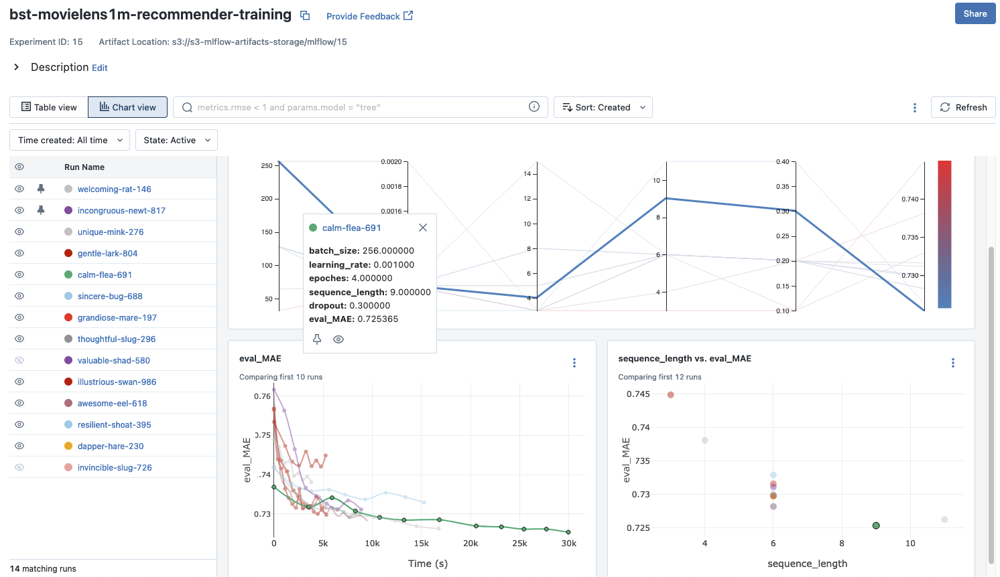

# ml-bst-movielens1m-recommender-training


## Run It Locally

define env in .env file

```sh
# Mlflow tracking url
TRACKING_URL=
# Mlflow experiment name
EXPERIMENT_NAME=bst-movielens1m-recommender-training
AWS_DEFAULT_REGION=
AWS_ACCESS_KEY_ID=
AWS_SECRET_ACCESS_KEY=
ENV=dev
```

```sh
python -m venv venv
source venv/bin/activate
pip install requirements.txt
pip install torch --index-url https://download.pytorch.org/whl/cpu
python train.py --artifact_dir "./artifacts" \
                --model_save_dir "./models" \
                --sequence_length 6 \
                --test_size 0.85 \
                --genres_length 4 \
                --embedding_dim 128 \
                --dropout 0.3 \
                --epoches 4 \
                --learning_rate 0.001 \
                --batch_size 256
```

## Run Using Docker Container
```sh
docker build . -t bst-movielens1m-recommender-training:latest  --platform linux/arm64/v8
```

```sh
docker run -it \
        --env-file .env \
        --cpus=4 \
        --shm-size=4g bst-movielens1m-recommender-training:latest \
        --artifact_dir "./artifacts" \
        --model_save_dir "./models" \
        --sequence_length 6 \
        --test_size 0.85 \
        --genres_length 4 \
        --embedding_dim 128 \
        --dropout 0.3 \
        --epoches 4 \
        --learning_rate 0.001 \
        --batch_size 256
```

## Mlflow Experiments
We choose the relatively low MEA with smaller sequence length due to cost-effective consideration

Run ID:7697d9cdf0f341f8ad8333da0f7df55d
Artifacts S3 Path: s3://s3-mlflow-artifacts-storage/mlflow/15/7697d9cdf0f341f8ad8333da0f7df55d




