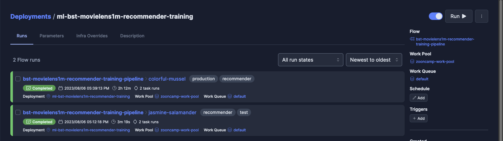

# Movielens 1m Movie Recommendation Based on  Behavior Sequence Transformer Model

This repository is to implement the behavior sequence transformer model proposed by Alibaba, which can be found in this paper: https://arxiv.org/abs/1905.06874.
We use the 1M version of the Movielens dataset to train a transformerd base recommendation to predict what movie users like most according to their basic demographic feauture and sequence of movie views.. However, we assume that in the inference stage the users are anonymous and without rating history, therefore we don't use them as features. We can refer to this github: https://github.com/Nelsonlin0321/ml-behavior-sequence-transformer-for-movie-recommendation for tutorial purpose of how to impletment behavior sequence transformer model with all features.


## Run It Locally

define env in .env file

```sh
# Mlflow tracking url
TRACKING_URL=
# Mlflow experiment name
EXPERIMENT_NAME=bst-movielens1m-recommender-training
AWS_DEFAULT_REGION=
AWS_ACCESS_KEY_ID=
AWS_SECRET_ACCESS_KEY=
```

```sh
python -m venv venv
source venv/bin/activate
pip install requirements.txt
pip install torch --index-url https://download.pytorch.org/whl/cpu
python train.py --artifact_dir "./artifacts" \
                --model_save_dir "./models" \
                --sequence_length 9 \
                --test_size 0.85 \
                --genres_length 4 \
                --embedding_dim 128 \
                --dropout 0.3 \
                --epoches 4 \
                --learning_rate 0.001 \
                --batch_size 256
                --env "test" 
```


## Run Using Docker Container
```sh
docker build . -t bst-movielens1m-recommender-training-pipeline:latest  --platform linux/arm64/v8
```

```sh
docker run -it \
        --env-file .env \
        --cpus=4 \
        --shm-size=4g bst-movielens1m-recommender-training-pipeline:latest \
        --artifact_dir "./artifacts" \
        --model_save_dir "./models" \
        --sequence_length 9 \
        --test_size 0.85 \
        --genres_length 4 \
        --embedding_dim 128 \
        --dropout 0.3 \
        --epoches 4 \
        --learning_rate 0.001 \
        --batch_size 256
        --env "test" 
```
or 

```sh
docker compose up
```


## Mlflow Experiments And Register
We register the relatively low MEA with smaller sequence length due to cost-effective consideration

Run ID:7697d9cdf0f341f8ad8333da0f7df55d
Artifacts S3 Path: s3://s3-mlflow-artifacts-storage/mlflow/15/7697d9cdf0f341f8ad8333da0f7df55d

```python
import mlflow
mlflow.set_tracking_uri("http://175.41.182.223:5050/")
run_id = "7697d9cdf0f341f8ad8333da0f7df55d"
model_uri = f"runs:/{run_id}/model"
mlflow.register_model(model_uri=model_uri,name="bst-movielens1m-recommender-training")
```


## Prefect Orchestration Deployment:
[Prefect](https://www.prefect.io/cloud) is a centralized, single pane of glass for deploying, monitoring, and managing the data workflows


- 1.config prefect.yaml file
The yaml file define how you define your data workflow

[Docs and Tutorial](https://docs.prefect.io/2.10.14/tutorial/deployments/)


- 2.deployment
```sh
prefect deploy
prefect worker start --pool 'zooncamp-work-pool'
prefect deployment run 'bst-movielens1m-recommender-training-pipeline/ml-bst-movielens1m-recommender-training'
```




## Unit Test

```sh
pytest
```